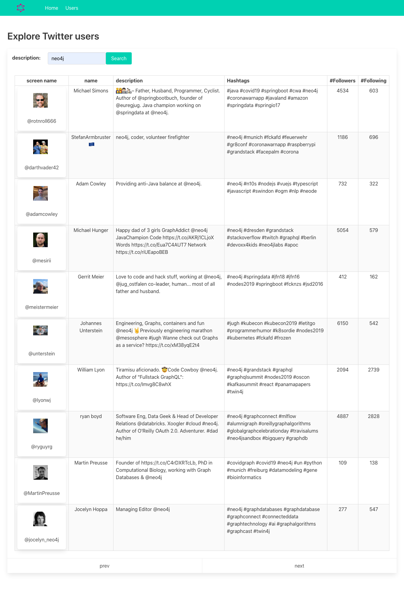
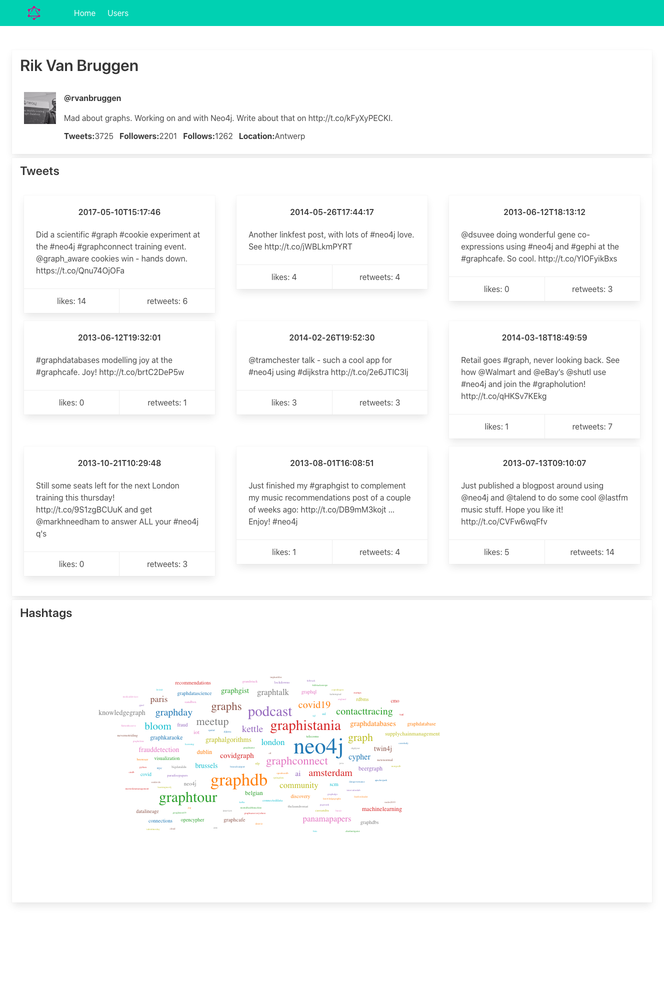

= Simple Twitter data explorer

Little demo application showcasing the integration of

 * Vuejs
 * AWS amplify (for Cognito/user-pools)
 * neo4j-graphql-js
 * graphQL with Apollo
 * and of course Neo4j

See the https://faboo.org/2020/09/vuejs-grandstack-cognito/[blog post] for details

The project was created via https://grandstack.io[GRANDstack] which substitution of the React part with Vuejs.

The vue application sources amplify configuration from a file `web-vue/src/aws-exports.js` which was created during `amplify add auth` call.

Could not find much information on that file, but it contains the following entries (values omitted):

[source]
----
const awsmobile = {
    "aws_project_region": "eu-central-1",
    "aws_cognito_identity_pool_id": "eu-central-1:..snip..",
    "aws_cognito_region": "eu-central-1",
    "aws_user_pools_id": "eu-central-1_..snip..",
    "aws_user_pools_web_client_id": "6..snip..",
    "oauth": {}
};

export default awsmobile;
----

Functionality is limetted, it allows search Twitter users via their descriptions and and display the last tweets from the database. Also some world-cloud with the HashTags of that user.

== User list
[#img-user-list, role="img-responsive"]
.List of users
[link=img/user-list.png]

== User page
[#img-user-page, role="img-responsive"]
.view on a user
[link=img/user-rik.png]

